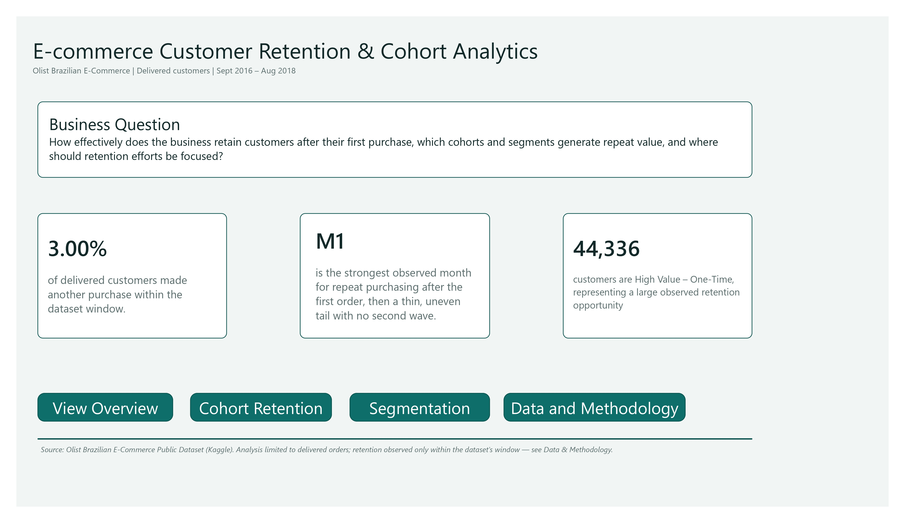
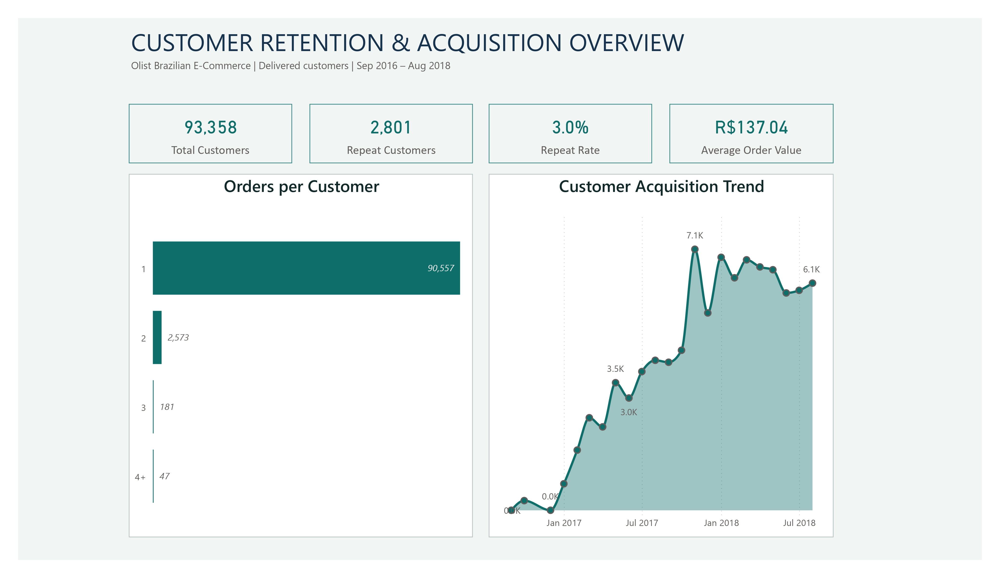
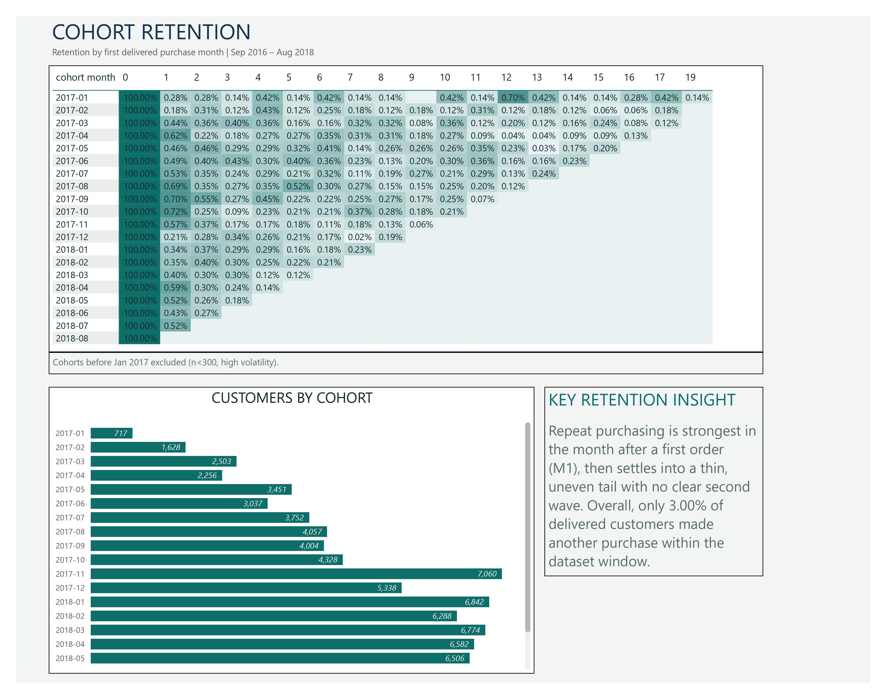
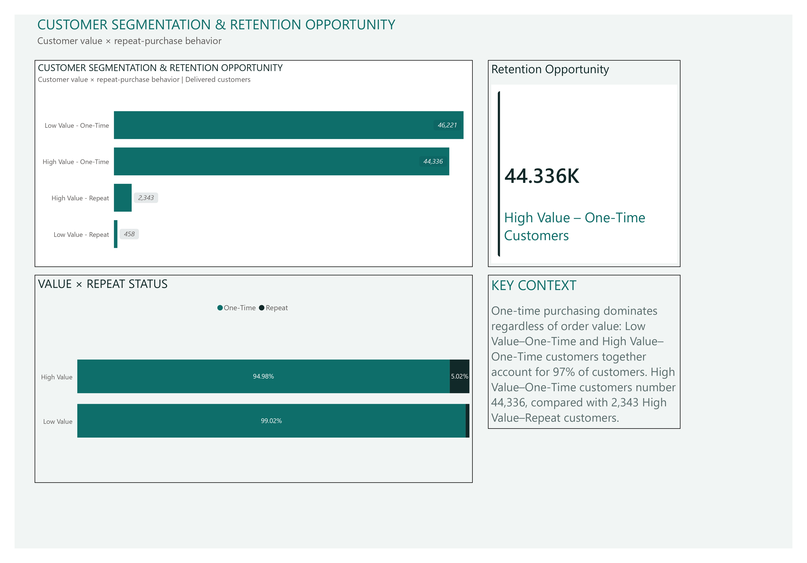
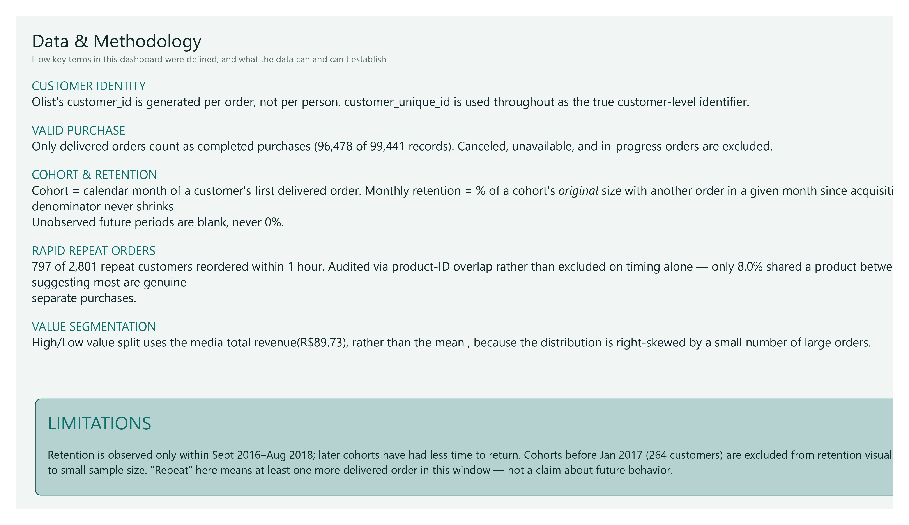

# E-commerce Customer Retention & Cohort Analytics


An end-to-end data analytics project that analyzes **customer-level retention and repeat-purchase behavior** using the **Olist Brazilian E-Commerce** dataset, covering **96,478 delivered orders across 93,358 customers** between **September 2016 and August 2018**.

The project features a custom Python ETL pipeline, a MySQL-backed analytical data model, DAX-driven cohort retention calculations, and a 5-page interactive Power BI dashboard built to answer a real customer-retention business question.

---

# Dashboard Preview

## Home



---

## Customer Retention & Acquisition Overview



---

## Cohort Retention



---

## Customer Segmentation & Retention Opportunity



---

## Data & Methodology



---

# Business Problem

Most public retention/churn datasets hand you a pre-labeled churn column. This project deliberately avoids that — Olist is a marketplace, not a subscription business, so retention had to be defined from raw purchase behavior rather than assumed.

This project investigates several business questions:

- How many customers ever make a second purchase, and how rare is repeat buying in this marketplace?
- When customers do return, how soon after their first order does it happen?
- Does the pattern of returning customers differ by acquisition cohort?
- Does spending more on a first order make a customer more likely to come back?
- Which customer segment represents the largest realistic opportunity for retention efforts?

---

# Project Highlights

- Built a custom modular ETL pipeline (extract → transform → validate → load) in Python
- Resolved a real identity bug in the source data (`customer_id` is assigned per order, not per person) before any retention logic was built
- Investigated 797 same-hour "repeat" orders directly via product-ID overlap rather than excluding them on a guessed duplicate rule
- Loaded a two-table star schema (customer dimension + customer-month fact table) into MySQL
- Built the cohort retention matrix as live DAX in Power BI, not pre-computed in Python — validated cell-by-cell against the original pandas analysis
- Designed a 5-page Power BI report with a dedicated Data & Methodology page documenting every non-obvious analytical decision

---

# Tech Stack

| Category | Technologies |
|-----------|--------------|
| Programming | Python |
| Data Processing | Pandas |
| Database | MySQL |
| BI Tool | Power BI |
| Data Modeling | Power Query, DAX |
| Version Control | Git & GitHub |

---

# Repository Structure

```text
ecommerce-customer-retention-analytics/
├── README.md
├── config/
│   └── config.py
├── data/
│   ├── raw/
│   └── processed/
├── src/
│   ├── extract.py
│   ├── transform.py
│   ├── validate.py
│   └── load.py
├── main.py
├── powerbi/
├── images/
└── docs/
```

---

# Data Pipeline

A custom pipeline was built to turn raw, order-level transaction data into a clean, validated customer-level analytical model — rather than importing a dataset that already defines "retention" for you.

### Extraction

- Loaded raw Olist order, customer, and order-item CSVs
- Converted purchase timestamps to proper datetime types at the source, before any downstream logic touched them

### Transformation

- Merged orders with customers and filtered to **delivered orders only**, the project's locked definition of a valid purchase
- Built a **customer dimension table**: one row per customer, with first purchase date, cohort month, total orders, repeat-customer flag, total revenue, and a value/repeat segment label
- Built a **customer-month fact table**: one row per customer per active month, feeding the cohort matrix
- Aggregated item-level order data to customer-level revenue (price only, excluding freight, since shipping cost reflects logistics rather than purchase value)
- Classified customers into four segments using a **median**, not mean, value split — customer revenue is right-skewed, so a mean-based cutoff would have classified most customers as low value

### Validation

Three structural checks run before any load to MySQL:

- No duplicate customer IDs in the customer dimension table
- No missing customer ID or cohort month values
- Total orders per customer reconciles exactly against the sum of their monthly order counts in the fact table

Additional methodology detail is available in:

```
docs/methodology_notes.md
```

---

# Dashboard Pages

## Home

- Business question
- Three evidence-backed headline findings
- Page navigation

---

## Customer Retention & Acquisition Overview

- Total Customers, Repeat Customers, Repeat Rate, Average Order Value KPIs
- Orders per Customer distribution
- Customer Acquisition Trend

---

## Cohort Retention

- Cohort × months-since-acquisition retention matrix, calculated in DAX
- Customers by Cohort chart
- Key Retention Insight callout

---

## Customer Segmentation & Retention Opportunity

- Four-segment customer breakdown (value × repeat status)
- Value × Repeat Status comparison
- Retention Opportunity card and Key Context callout

---

## Data & Methodology

- Customer identity resolution
- Valid purchase definition
- Cohort and retention definitions
- Rapid repeat order investigation
- Value segmentation threshold
- Known limitations

---

# KPIs

The dashboard includes the following business metrics:

- Total Customers
- Repeat Customers
- Repeat Rate
- Average Order Value
- Cohort Size
- Monthly Cohort Retention %
- Customer Segment (Value × Repeat Status)

---

# Key Insights

- Only **3.00%** of delivered customers (2,801 of 93,358) ever placed a second order within the observed window — repeat buying is genuinely rare on this marketplace.
- Retention is strongest the month immediately after acquisition (M1), then settles into a thin, uneven tail of roughly 0.1%–0.4% with no later resurgence.
- **44,336 customers** are High Value – One-Time: they spent above the median on a single order and never returned — the largest realistic retention opportunity identified, close in size to the Low Value – One-Time segment (46,221).
- High-value customers return at roughly **5x** the rate of low-value customers (5.02% vs. 0.98%) — though one-time purchasing still dominates both groups.
- Using `customer_id` instead of `customer_unique_id` would have made every customer appear to be a one-time buyer, since `customer_id` is generated fresh per order in this dataset — resolving this was the first and most important data-quality decision in the project.

---

# Data Sources

### Transaction Data

- Olist Brazilian E-Commerce Public Dataset (Kaggle)

---

# Getting Started

Clone the repository:

```bash
git clone https://github.com/kappsdue/ecommerce-customer-retention-analytics.git
```

Download the Olist dataset into `data/raw/`, update your MySQL credentials in `config/config.py`, then run the pipeline:

```bash
pip install -r requirements.txt
python main.py
```

Open the Power BI dashboard:

```
powerbi/Ecommerce_Retention_Analytics.pbix
```

---

# Notes

- Retention is observed only within the dataset's window (Sept 2016–Aug 2018); recent cohorts have had less time to demonstrate repeat behavior than earlier ones.
- Cohorts before January 2017 (264 customers total) are excluded from the retention visuals due to small sample size and high volatility.
- "Repeat customer" means at least one additional delivered order within this dataset's window — not a prediction about future behavior.
- Full methodology reasoning, including the rapid-repeat-order audit, is documented in `docs/methodology_notes.md`.

---

# 👤 Author

**Kaustubh**

If you found this project useful or interesting, feel free to connect with me or explore my other repositories.

⭐ If you like this project, consider starring the repository.
